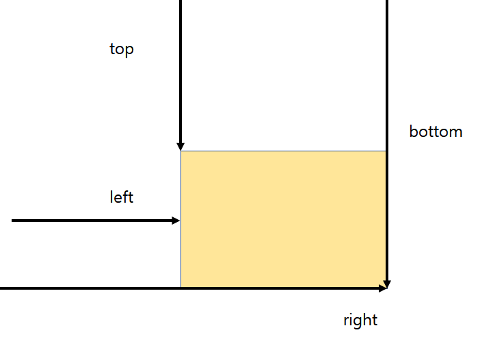

## 2.1 Web APIs 넌 누구니 ?

### APIs

- Application Programming Interfaces

  - 유튜브에서 제공하는 API를 이용하면 내부적으로 어떻게 동작하는지 몰라도 간단하게 앱을 만들 수 있다

- Web APIs Security

  - 사용자의 권한 요청이나 HTTPS를 요구할 수 있음

  - 보안이 중요하기 때문에 어떤 API는 HTTPS에서만 동작한다

- HTTP (Hypertext Transfer Protocol)

  - 웹 클라이언트와 서버가 어떻게 통신하는지(request - response) 를 정해놓은 통신규약

  - 서버에 비밀번호를 보내면 아무런 암호 처리리가 되지 않은채로 보내지기 때문에 그대로 비밀번호가 전송되어서 해커가 어떤 값이 볼 수 있다

- HTTPS (Hypertext Transfer Protocol Secure)

  - 정보를 주고 받는 것이 보안 처리가 잘 된 것

  - HTTP와는 달리 비밀번호가 encrypted 되어 전송되기 때문에 해커가 무슨 값이 전성되었는지 볼 수 없다

## 2.2 Browser 구조 분석

- Window

  - 윈도우 화면의 전체, 즉 브라우저 전체를 나타낸다

- Document

  - 브라우저의 메뉴 같은 부분을 제외한, 우리가 작성한 HTML이 화면에 보이는 부분

- Navigator

  - 사용자 눈에는 보이지 않지만 브라우저에 관련된 정보가 담겨있는 오브젝트

- 브라우저가 실행될 때 웹페이지를 읽으면 글로벌 오브젝트에는 window 오브젝트가 들어가 있고 window 오브젝트에는 DOM, BOM, Javscript 같은 오브젝트들이 들어있다.

  - window

    - DOM (Document Object Model)

      - document

    - BOM (Browser Object Model)

      - navigator

      - location

      - fetch

      - storage

    - JavaScript

      - Array

      - Map

      - Date

- DOM 오브젝트 안에는 페이지별로 우리가 정의한 요소들이 Tree 형태로 구성되어 있고,

- BOM 오브젝트 안에는 브라우저와 관련된 오브젝트들인 navigator, location, fetch, storage와 같은 것들이,

- 그리고 Javascript 오브젝트 안에는 기본적인 Javascript와 관련된 Array, map, Date 같은 오브젝트들이 있다

- 즉, window라는 글로벌 오브젝트 안에 각각의 DOM, BOM, JavaScript에 대한 데이터가 들어있는 것이다.

<br/>

- 크롬 브라우저에서 실행

```js
console.log(window); // 다양한 web api 확인할 수 있다

console.log(this); // window가 출력된다, window는 클로벌 오브젝트이기 때문에

// 따라서 아래도 같은 결과가 출력된다
console.log(innerWidth);
console.log(window.innerWidth);

console.log(window.navigator);
```

## 2,3 실습1. 윈도우 사이즈 표기

- window.screen.width , window.screen.height

  - 사용자의 모니터의 사이즈를 구할 수 있다

```js
window.screen.width;
window.screen.height;
```

- window outer

  - 브라우저의 URL와 Tab을 포함한 전체적인 브라우저의 사이즈를 나타낸다

```js
window.outerwidth;
window.outerHeight;
```

- window inner

  - 브라우저의 URL와 Tab을 제외한 브라우저의 사이즈를 나타낸다. 그리고 스크롤이 있는 경우 스크롤에 해당하는 부분도 포함한다

```js
window.innerwidth;
window.innerHeight;
```

- documentElement.clientWidth, documentElement.clientheight

  - 브라우저의 URL와 Tab을 제외한 화면상에 나타내는 브라우저의 사이즈를 나타낸다. 이 때 스크롤이 있는 경우에도 스크롤 아래 화면에 보이지 않는 부분은 사이즈에 포함시키지 않는다

```javascript
document.documentElement.clientWidth;
document.documentElement.clientheight;
```

## 2.5 정말 중요한 브라우저 좌표

- Element.getBoundingClientRect()

  - 모든 요소는 getBoundingClientRect를 가지고 있다

- 요소의 width, height, left, top 정보를 알 수 있다

- left는 x축, top은 y축과 같이, 왼쪽에서 얼마나 떨어져 있는지, 위쪽에서 얼마나 떨어져 있는지를 구할 수 있다

- right와 bottom은 css에서 right와 bottom을 구하는 방법과 다르다

- css에서는 right와 bottom이, 오른쪽에서 그리고 아래쪽에서 얼마나 떨여져있는지를 나타내지만

- getBoundingClientRect에서는 아래 그림과 같이 right는 제일 왼쪽에서 얼마나 떨어져 있는지, bottom은 위에서 얼마나 떨어져 있는지를 나타낸다.

<br/>



<br/>

```html
<body>
  <div></div>
  <div></div>
  <div class="rect"></div>
  <div></div>
</body>
```

```js
const rect = document.querySelector('.rect');
const clienRect = rect.getBoundingClientRect();
```

- clientX, Y vs page X, Y

```js
const coordinates = (e) => {
  console.log(`client: ${e.clientX}, ${e.clientY} `);
  console.log(`page: ${e.pageX}, ${e.pageY} `);
};
```

- click과 같은 event 발생하면 eventlistner로 event가 전달되는데, 이 때 해당 event를 통해서 브라우저의 좌표를 구할 수 있다

- clientX, Y

  - clientX, Y는 브라우저에서(네모난 창에서 x와 y가 얼마나 떨어져 있는지를 나타낸다

- pageX, Y

  - pageX, Y는 화면상에 보이는 브라우저를 기준으로 한 좌표가 아니라 페이지 자체에서 떨어져 있는 x와 y를 의미한다 , 이 때 페이지는 우리 눈에 보이지 않는 제일 위의 지점일 수도 있다.

  - 예를 들어, 스크롤 아래의 부분에서 click 이벤트를 발생한 다음 pageY 구하게 되면, 화면에서 보이는 창에서 y만큼 떨어진 좌표를 구하는 것이 아니라 페이지 시작 부분에서 y 값을 구한다

## 2.6, 7 좌표 실습

```html
<style>
  body {
    background-color: black;
  }

  div {
    width: 250px;
    height: 250px;
    background-color: beige;
    margin-bottom: 4px;
    border-radius: 4px;
  }

  .special {
    background-color: blue;
  }
</style>
<body>
  <div></div>
  <div></div>
  <div></div>
  <div></div>
  <div></div>
  <div></div>
  <div></div>
  <div class="special"></div>
  <div></div>
  <div></div>
  <div></div>
  <script>
    const special = document.querySelector(',special');
    special.addEventListener('click', (e) => {
      const rect = special.getBoundingClientRect();
      console.log(rect);
      console.log(`client: ${e.clientX}, ${e.clientY} `);
      console.log(`page: ${e.pageX}, ${e.pageY} `);
    });
  </script>
</body>
```

## 2.8, 9 윈도우 스크롤링 APIs

```html
<style>
  body {
    background-color: black;
  }

  div {
    width: 250px;
    height: 250px;
    background-color: beige;
    margin-bottom: 4px;
    border-radius: 4px;
  }

  .special {
    background-color: blue;
  }

  aside {
    position: fixed;
    top: 20px;
    right: 20px;
  }
</style>
<body>
  <div></div>
  <div></div>
  <div></div>
  <div></div>
  <div></div>
  <div></div>
  <div></div>
  <div class="special"></div>
  <div></div>
  <div></div>
  <div></div>
  <aside>
    <button class="scroll-by">Scroll by 100px - y축에서</button>
    <button class="scroll-to">Scroll to 100px - y축에서</button>
    <button class="scroll-into">Scroll into sepcial</button>
  </aside>
  <script>
    const special = document.querySelector(',special');
    special.addEventListener('click', (e) => {
      const rect = special.getBoundingClientRect();
      console.log(rect);
      console.log(`client: ${e.clientX}, ${e.clientY} `);
      console.log(`page: ${e.pageX}, ${e.pageY} `);
    });

    const scrollBy = document.querySelector('.scroll-by');
    const scrollTo = document.querySelector('.scroll-to');
    const scrollInto = document.querySelector('.scroll-into');

    scrollBy.addEventListener('click', () => {
      window.scrollBy(0, 100);
      // 100px y축으로 이동
    });

    scrollTo.addEventListener('click', () => {
      window.scrollTo(0, 100);
      // y가 100인 곳으로 이동
    });

    scrollInto.addEventListener('click', () => {
      spcial.scrollIntoView();
      // speical이 있는 곳으로 이동
    });
  </script>
</body>
```

## 2.10 Window load의 대비밀

```html
<head>
  <script src="test.js" defer></script>
</head>
<body>
  <script>
    // only document(defer) - document만, 즉 html만 완료되면 호출된다
    window.addEventListener('DOMContentLoaded', () => {
      console.log('DOMContentLoaded');
    });

    // after resources - 페이지 안에서 사용되고 있는 모든 리소스(폰트, 이미지 ,css 등)가 다운로드가 완료되면 그 때 실행된다
    window.addEventListener('load', () => {
      console.log('load');
    });

    // unloaded 되기 전에 실행, 즉 페이지를 나가기 전에 실행된다
    window.addEventListener('beforeunload', () => {
      console.log('beforeunload');
    });

    // resource is being unloaded, 리소스 같은 것들이 unloaded되기 전에
    window.addEventListener('unload', () => {
      console.log('unload');
    });
  </script>
</body>
```

```js
// test.js

console.log('test - js loaded');
```

- test - js loaded -> DOMContentLoaded -> load 순으로 출력된다

- html이 파싱이 끝나고 나서 DOMContentLoaded 라는 이벤트가 발생하기 이전에 test -js loaded가 출력된다

- 따라서 자바스크립트 파일이 어떤 리소스(ex. 이미지, 폰트)에 대허서 무엇이낙 수행하지 않는 이상DOMContentLoaded 안에서 동작을 수행하면 사용자가 더 빨리 화면을 볼 수 있다는 당점이 있따

- 그리고 defer 옵션을 사용한다면 DOMContentLoaded 이전에 js 파일을 받을 수 있따

---

## Reference

- 2.1

  - [MDN Web API](https://developer.mozilla.org/en-US/docs/Learn/JavaScript/Client-side_web_APIs/Introduction)
  - [Web API collection](https://developer.mozilla.org/en-US/docs/Web/API)
  - [Security](https://www.thoughtco.com/what-javascript-cannot-do-2037666)

- 2.2
  - [Document](https://developer.mozilla.org/en-US/docs/Web/API/Document)
  - [Window](https://developer.mozilla.org/en-US/docs/Web/API/Window)
  - [Viewport](https://developer.mozilla.org/en-US/docs/Glossary/layout_viewport)
  - [Navigator](https://developer.mozilla.org/en-US/docs/Web/API/Navigator)
