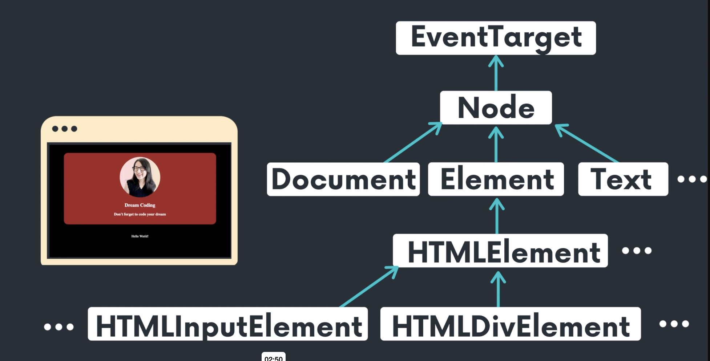
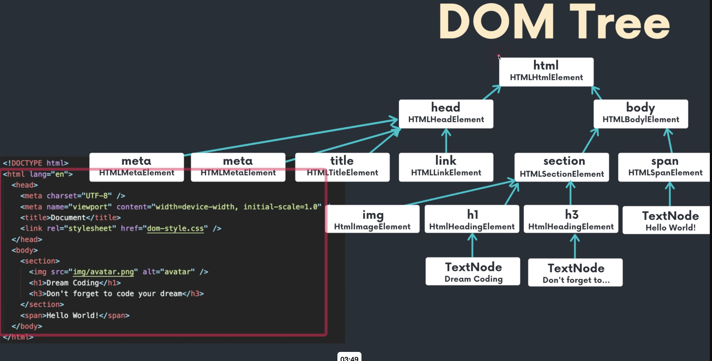
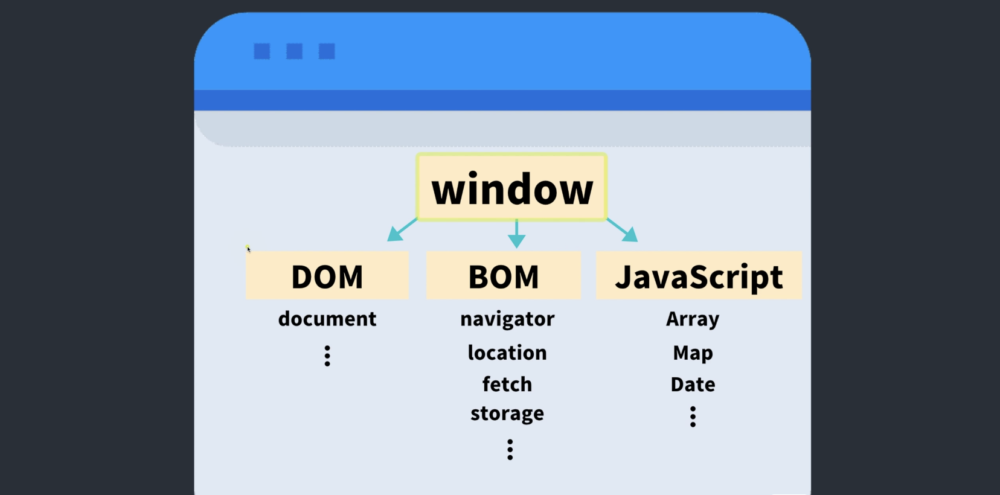
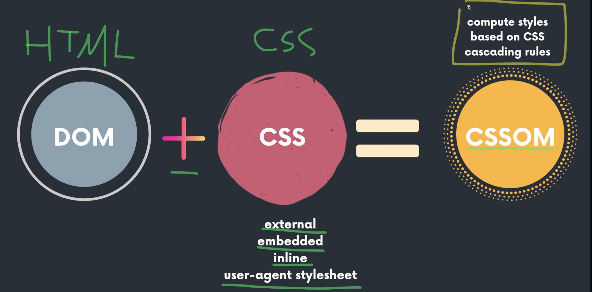
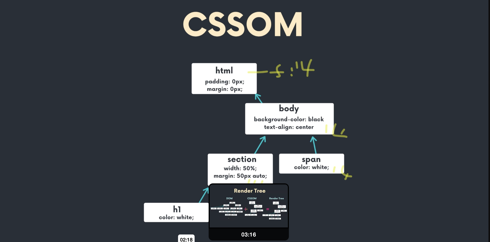
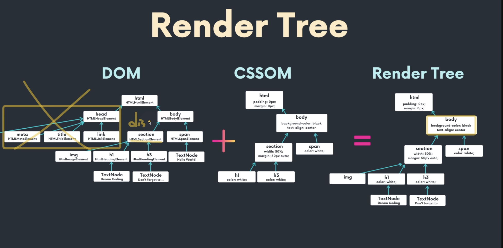
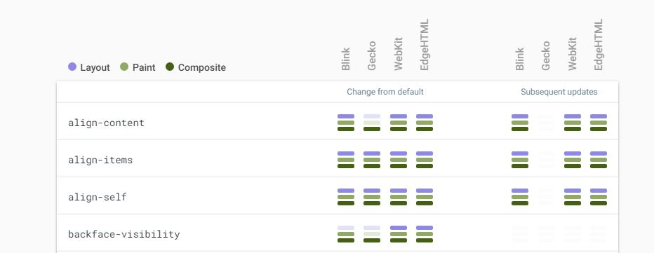
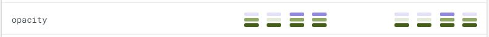
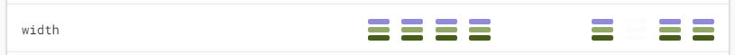

## 4.1 DOM 큰 그림 이해하기

### DOM (Document Object Model)

- 우리가 웹 페이지를 만드면 `html` 파일을 브라우저에서 읽게되고 브라우저는 `body, section, img` 태그 등 각각의 태그들을 분석해서 노드(Node)라는 오브젝트로 변환하게 된다

- 노드는 여러가지 DOM 타입들이 상속하는 인터페이스 이며 노드 안에는 작성한 클래스나 텍스트와 같은 정보들이 포함되어 있다

- 그리고 노드라는 오브젝트는 아래 그림과 같이 `EventTarget` 이라는 오브젝트를 상속하는데 결국 노드라는 오브젝트는 `EventTarget`의 오브젝트라는 것을 알 수 있다.

- `EventTarget`에는 `addEventListener`, `removeEventListener`, `dispatchEvent`라는 총 세가지의 Method가 있는데 이를 통해 다른 모든 노드에서 `addEventListenr` 통해 이벤트를 등록할 수 있으며 모든 노드는 이벤트가 발생할 수 있다는 것을 알 수 있다

- 또한 Node에서도 다양한 Method를 제공하기 때문에 아래처럼 Node를 상속하는 다른 오브젝트들에서도 Node에서 제공하는 Method 사용할 수 있다



- 클래스 상속도

  - 이 부분은 DOM에 존재하는 클래스들의 상속도를 나타낸다.

  - 우리가 작성한 HTML 태그가 DOM요소로 변환될때 태그에 맞는 DOM 클래스로 변환되는데 그 클래스들의 상속도를 나타내는 것

- `Document`도 `Node`를 상속하기 때문에 `Document`에서도 이벤트가 발생하고 있고, `이미지`, `html `요소들은 `Element`로 변환이 되는데 `Element`도 `Node`를 상속하기 때문에 이벤트가 발생할 수 있다

- 따라서 모든 노드는에서 이벤트가 발생할 수 있다

- `Element`안에서도 다양한 `Element`가 있다.` HTML` 요소라면 `HTMLElement`가 되고 `SVG` 요소라면 `SVGElement`가 되는데 이처럼 각각의 타입별로 `Element`가 존재하게 된다

- 그리고 `HTMLElement` 안에서는 어떤 태그를 쓰느냐에 따라서 `HTMLInputElement`, `HTMLDivElement` 등이 될 수 있다

- 즉, 모든 태그의 요소를 위한 `HTMLInputElement`, `HTMLDivElement`등은 `HTMLElement` 를 상속한다.

- 그리고 `HTMLElement` 는 `Element`를 상속하고, `Element`는 `Node`를, 그리고 `Node`는 `EvnetTarget`을 상속한다

- 즉, 브라우저는 `HTML` 코드를 해석해서 트리 형태로 구조화된 노드들을 가지고 있는 문서(DOM Tree)를 생성한다

- `HTML` 문서가 브라우저에 의해 해석되어 실제 문서를 나타내는 노드 객체들의 트리 구조로 변환이되는 것이다.

- 따라서 만든 HTML 파일이 브라우저가 읽을 때 DOM Tree로 변환되어 브라우저 웹페이지상에 나타나게 되고 프로그래밍 언어(자바스크립트)로 DOM Tree의 각 요소 (ex. HTMLDivElement)에 접근하여 요소를 수정, 삭제, 추가등과 같은 작업을 수행 할 수 있다'

- `DOM`의 목적은 JS를 사용해서 이 문서에 대한 스크립트 작성(삭제, 추가, 바꾸기, 이벤트처리, 수정)을 위한 프로그래밍 인터페이스를 제공하는 것이다

---

- 다음과 같은 `html` 파일은 `DOM Tree`로 변환하면 아래 그림과 같이 그릴 수 있다



- HTML페이지가 DOM트리로 변환 되었을때 실제로 HTML 페이지가 어떻게 DOM 트리로 변환되는지 볼 수 있다.

- 그리고 각각의 태그들이 어떤 DOM 클래스로 변환이 되었는지 나온다.

- `DOM Tree`는 아래 그림과 같은 방식으로 만들어지는데, `html` 태그 안에 `head`태그와 `body`태그가 있는 것 처럼 제일 상위에 `HTMLHtmlELement` 노드가 있고 그 안에 `HTMLHeadElement`, `HTMLBodyElement`가 있다

- 그리고 `head` 태그 안에 `meta`태그, `title`태그 `link`태그가 있는 것처럼 각 태그의 노드들이 `HTMLHeadElement`안에 있는 것을 확인할 수 있다

- `h1` 태그 안에 텍스트가 있기 때문에 `HTMLHeadingElement` 안에 `TextNode`가 존재하게 된다

---



- DOM트리는 우리의 HTML 페이지가 브라우저가 이해하고, 변경/업데이트가 가능한 오브젝트 형식으로 변환된 것

- 우리의 웹페이지에 대한 정보 (DOM TREE)외에도 브라우저에 존재하는 다양한 정보들 (BOM, 자바스크립트 엔진....등등) 다양한 정보를 가지고 있다.

- 정확한 그래프는 아니지만, window라는 글로벌 오브젝트 안에 각각의 DOM, BOM, JavaScript에 대한 데이터가 들어있다는걸로 이해하시면 좋을 것.

- 브라우저가 실행될 때 웹페이지를 읽으면 글로벌 오브젝트에는 window 오브젝트가 들어가 있고 window 오브젝트에는 DOM, BOM, Javscript 같은 오브젝트들이 들어있다.

- `DOM` 오브젝트 안에는 페이지별로 우리가 정의한 요소들이 Tree 형태로 구성되어 있고, `BOM` 오브젝트 안에는 브라우저와 관련된 오브젝트들인 `navigator, location, fetch, storage`와 같은 것들이, 그리고 Javascript 오브젝트 안에는 기본적인 Javascript와 관련된 Array, map, Date 같은 오브젝트들이 있다

- 즉, window라는 글로벌 오브젝트 안에 각각의 DOM, BOM, JavaScript에 대한 데이터가 들어있는 것이다.

<br/>

## 4.3 웹 페이지 요소 분석 (콘솔 툴 활용)

- 4.3 폴더 참조

  - 구글 개발자 모드에서 실행

```js
// Section 태그 선택

$0;
//선택한 요소 출력된다

$0.childNodes;

$0.nextSibling;

$0.parentNode;

$0.nodeName;
```

## 4.4 알면 유용한 CSSOM

### CSSOM (CSS Object model)

- 브라우저에서 DOM을 만들게 되면 우리가 정의한 CSS를 병합해서 CSSOM 이라는 트리를 다시 만들게 된다.

- 브라우저가 html 파일을 DOM으로 만들었다면 html 파일 안에 있는 스타일 즉, 임베디드된 스타일이나, CSS 파일에 정의한 CSS나, html 태그에 정의한 style 요소들을 비롯해서 이런 스타일이 따로 지정되어 있지 않아도 브라우저 상에서 기본적으로 가지고 있는 스타일에 대한 모든 정보들을 합쳐서 CSSDOM 이라는 트리를 만들게 된다.



- 따라서 CSSOM에는 우리가 정의한 스타일 뿐 아니라 브라우저에서 기본적으로 설정된 모든 속성 값들이 cascading rule에 의해 정의되어 있는데 이것을 computed styles라고 한다

- CSSOM은 다음 그림과 같은 구조로 표현 할 수 있다



- 예를 들어, 제일 부모인 html에서 font size를 14px로 지정하면 cascading rule에 의해 body, section h1등 모든태그의 font size가 14px이 된다.

- 즉, CSSOM에는 이렇게 계산된 모든 스타일에 관련된 속성들이 포함되어 있다

- 브라우저가 html 파일을 읽게 되면 제일 처음 DOM Tree를 만들고, 그 다음에 CSS파일을 읽은 다음 스타일을 모두 계산해서 최종적으로 확정된 CSSOM을 만들게 된다.

- 그 다음 DOM과 CSSOM을 합해서 사용자에게 최종적으로 브라우저에 표기될 것들만 render tree로 만들어진다 (DOM + CSSOM = Render Tree)



- Render Tree로는 최종적으로 브라우저에 표기될 것들이 그려지기 때문에 head와 같은 태그는 포함 되지 않는다

- 만약 body에 `display:none` 속성처럼 브라우저에 표시를 하지 않는 속성이 있으면 최종 render tree에는 포함되지 않는다

- 하지만 opacity가 0이거나 visibility가 hidden으로 설정되어 있다면 사용자 눈에는 보이지 않지만 요소는 존재하기 때문에 이러한 요소들은 render tree에 포함된다

- 그리고 CSS에는 cascading rule이라는 것이 존재하기 때문에 CSS를 따로 정의하지 않았어도 브라우저에서 설정된 기본적인 css 파일이 있다면 해당 스타일이 적용된다.

---

### Q.

- 안녕하세요. 브라우저 동작과정에 대한 질문이 있습니다.

- 1. 도메인으로 사이트 접속.

- 2. dns 서버에 가서 ip로 변환 뒤 해당 서버 라우팅해서 찾아감

- 3. 해당 서버에서 브라우저가 요청한 index.html 반환

- 4. 브라우저에서 받은 뒤 한줄씩 파싱.

- 5. defer 속성이 있는 javascript 는 병렬적으로 다운로드 되면서 html이 다 파싱되면 실행

- 대충 기본적으로 이렇게 동작하는 것으로 알고 있습니다.

- 첫번째로 link 태그로 styles.css를 가지고 올때입니다. 이 부분은 index.html 을 파싱하면서 link라는 태그를 만나게 되면 javascript를 fetching하는 것처럼 styles.css를 fetching하게되고 다운로드가 다될때까지 html파싱하던 작업들이 멈추게 되는건가요?

- 두번째로 첫번째와 같은 맥락입니다. img src 속성이나 css에서 background-image: url() 에 이미지 경로를 적어주게 되는데 이 image들도 html을 파싱하거나 styles.css를 fetching 하고 읽어들일때 보이면 javascript처럼 서버에 요청을 보내고 fetching하게 되고 html파싱하던 작업들이 멈추게 되는건가요

### A.

- 1. CSS는 HTML 파싱을 block하게 될까?

- 일반적으로 얘기 하자면 CSS 자체로는 HTML, 즉 DOM 구조를 변경시킬 수 없기 때문에 HTML 파싱을 block 하지 않아요. HTML을 parsing 하면서 DOM 트리를 만들다가 link태그에 외부 css 파일이 있으면 다운로딩 요청만 해놓고 계속 DOM트리릴 만들어요.

- CSS 파일이 다운로드 되면 CCSOM 트리를 만들고, 그것을 종합해서 최종 reder tree가 만들어 지게 되죠 :)

- 반대로, 자바스크립트 파일은 DOM 구조를 변경시킬 수 있기 때문에 파싱을 하다가 자바스크립트가 연결된 script 태그를 만나게 되면 파싱을 멈추고 자바스크립트를 다운로드 하고 실행까지 하게 되어요. (따로 defer, async 옵션을 쓰지 않으면요)

- 자바스크립트 안에서 또 CSS 스타일을 변경해서 DOM트리 자체를 변경할 수도 있기 때문에 브라우저마다 구현 사항이 다르겠지만, 외부 자바스크립트와 외부 CSS 파일을 어떤 순서로 연결 했냐에 따라서 CSS 파일을 요청할때 parsing이 멈출 수도 멈추지 않을수도 있어요.

- 또, 브라우저에게 이 파일은 정말 중요하니깐 파싱 하기 전에 이거 먼저 다운로드 받아줘!

- 라고 말할 수 있는 "preload" 속성이 하나 있어요 :)

- 최근에 도입된거라 Firefox같은 브라우저는 아직 지원을 하지 않는것이 함정 ㅎㅎ

- https://developer.mozilla.org/en-US/docs/Web/HTML/Preloading_content

- 두번째 질문은 앞에서 설명했던 것처럼, 이미지 파일과 같은 리소스들은 DOM트리 자체를 변경하지 않기 때문에 파싱에는 전혀 영향을 주지 않는답니다 :)

### Q.

- 답변 감사합니다! 항상 많이 배워가는 것 같습니다.

- 기본적으로 DOM tree에 영향을 주지 않는 것들은 html 파싱을 block 하지 않는 거군요.

- 근데 외부 자바스크립트를 이용하여 css를 건들이게 되면 dom 트리를 변경할수도있다고 하셨는데 예를 한번 들어주실 수 있을까요. 제가 생각하는 건 자바스크립트로 css를 건들이게 되면 inline style로 적용되기 때문에 attribute node 가 추가 되서 돔트리가 변경되는 것 같은데 맞는지모르겠네요 ㅎㅎ..

### A.

- 아, 그 부분은, 흠 대표적인 예를 들자면:

- 자바스크립트에서 어떤 DOM요소의 computed styles를 요청 할 수 있어요.

- 여기서 아직 CSS가 다운로드 되어져있지 않다면 스타일을 받아 올 수 없겠죠?

- 그래서 브라우저 마다 다르겠지만, 그런 경우를 대비해서 CSS 파일을 받기 전까지 나머지 HTML 파싱이 멈춰질 수 있어요 :)

- (이건 정말 브라우저 마다 구현사항이 달라서 일반화 해서 얘기를 할 수 없네요 하하)

<br/>

## 4.5 성능 보장 렌더링 순서 (정말 중요)

### Criticala Rendering Path

- html 페이지에서 브라우저가 표시할 수 있는 이 단계까지를 `Critical Rendering Path`라고 한다

- 브라우저가 URL을 입력하게 되면 다음과 같은 순서로 진행된다

- Request / Response -> Loaindg -> Scripting -> Rendering -> Layout -> Painting

1. Request / Response

   - 브라우저가 서버에게 html 파일 요청

2. Loading

   - html 파일을 서버에서 데이터 받아서 로딩

3. Scripting

   - html 파일을 한 줄씩 읽어서 DOM요소로 변환

   - CSS요소를 CSSOM으로 변환

4. rendering

   - 브라우저에 표시하기 위해 Render Tree만든다

5. layout

   - 렌더링 트리를 만든 다음에 어떤 위치에 얼마나 그릴지 계산해준다

6. painintg

   - 앞서 계산한 것들을 브라우저에 그려준다

<br/>

- 앞의 과정을 어떤 일을 하는지에 따라 카테고리를 나눠서 생각해보면 다음과 같이 `Construction Part`와 `Operation Part`로 나눌 수 있다

### Construction Part

- DOM → CSSOM → Render Tree

- Construction Part는 Render Tree 까지 만드는 과정을 포함한다

- Construction Part는 앞의 순서에서 Request / Response -> Loaindg -> Scripting -> Rendering 단계 까지를 포함한다

### Operation Part

- Layout → Paint → Composition

- Render Tree 를 이용해서 구조를 작성하고 어디에다 배치할 건지 계산을 한 다음에 실제로 브라우저 window에 그림을 그려주는 부분이 operation Part이다.

- Operation Part는 앞의 순서에서 Layout -> Painting 까지를 포함한다

<br/>

### Layout

- Render Tree에는 DOM 요소 뿐 아니라 최종적으로 계산된 CSS 스타일이 포함되어져 있다

- 따라서 이 정보 기반으로 요소의 크기와 어느 위치에 배치 할지를 계산하여 레이아웃을 구성한다.

- 이 요소는 이 정도 위치에, 그리고 이 정도 크기에 배치하고, 다른 요소는 또 다른 곳에 두겠다고 레이아웃을 구상하는 단계이다

- x와 y 그리고 width와 height 같은 것들이 계산된다

### Paint

- Layout 다음으로 Paint 과정이 일어난다

- 앞서 Layout 과정에서 계산한 요소들을 브라우저에 바로 그리는 것이 아니라 이 요소들을 어떻게 배치했느냐에 따라 Paint 과정에서는 각각 잘게 나누어서 이미지를 준비해 놓는다.

- 이러한 각각의 요소들, 이미지를 비트맵이라고 한다.

- 즉, Paint 과정에서 컴퓨터가 이해할 수 있는 비트맵 데이터로 변환된다

- 브라우저에 따라 다양한 속성 값에 따라 layer를 만들게 된다

- z-index를 사용한다고해서 무조건 layer가 만들어지는 것은 아니지만 간단한 예로, css에 z-index가 적용되어 다른 부분 보다 높은 z축의 순서를 가지는 부분이 있으면 브라우저는 이를 따로 묶어서 Layer를 준비하고 또 나머지 z-index가 같은 부분이 있으면 이를 묶어서 Layer로 준비하는 방식으로 Paint 단계에서는 Layer 기능을 이용해서 각 Layer 별로 준비해 놓는다

  - 꼭 z-index 별로 아니라 다양한 속성 값에 따라 브라우저 엔진 마다 성능 개선을 위해 레이어를 만든다

- 이렇게 하는 이유 브라우저가 성능개선을 위해 스스로 준비하는 것이다

- 만약 앞서 Layout 단계에서 계산한 요소의 위치를 움직이거나 투명도를 바꾸는 경우 Layer 기능을 이용하지 않는다면 브라우저는 한 부분만 바꾸기 위해 전체적으로 다시 그림을 그리고 업데이트 된 부분을 변경해주어야 한다

- 하지만 레이어를 사용하면 특정 레이어가 변경되었을 때 그 레이어만 변경시키면 된다

- 예를 들어, CSS에는 `will-change` 속성이 있는데 이 속성을 요소에 적용하게 되면 브라우저는 해당 요소가 나중에 변할 수도 있다는 것을 알게되고 해당 요소를 위한 새로운 Layer를 준비한다

- 따라서 `will-change`속성이 적용된 요소가 opacity 가 바뀐다면 해당 layer만 다시 바뀌게 되는 것이다

- 하지만 `will-change` 속성을 너무 많이 쓰면 불필요하게 너무 많은 레이어를 준비하게 되서 브라우저 성능이 안좋아질 수 있기 때문에 남용해서 사용하는 것은 좋지 않다

- 레이어는 가급적이면 작을 수록 성능향샹에 좋다

- 브라우저마다 어떻게 레이어를 형성하는지는 내부 구현 방식에 따라서 달라 지겠지만 대부분은 transform이나 opacity 그리고 will-change 같은 요소들을 쓰면 새로운 레이어가 만들어진다

### Composition

- Composition 단계에서는 앞의 Layout과 Paint 단계를 거쳐 준비된 Layer들을 순서대로 차곡차곡 브라우저 위에 표시한다

- z-index 순서로 낮은 순서부터 시작해서 z-index가 가장 높은 layer를 제일 나중에 브라우저에 표시한다

<br/>

- Construction Part(time to first render)에서 주의할 점

  - Construction Part는 DOM요소로 변환하고 CSSOM을 만들고 이를 합쳐서 Render Tree 까지 만드는 것을 의미하고 그 다음에 Operation Part에서 Layout, Paint, Composition을 통해서 최종적으로 사용자에게 웹 페이지가 보여지게 되는 것이다

  - DOM에서 렌더링 트리를 빠르게 만들 수 있는 방법은 DOM 요소가 작으면 작을 수록 그리고 CSS 규칙이 작으면 작을 수록 트리가 작아지기 때문에 빠르게 만들 수 있다

  - 따라서 불필요한 태그, 예를 들면 div 또는 wrapping 클래스나 wrapping 요소를 만드는 것 이러한 것들 자제해서 최대한 요소들을 작게 만드는 것이 중요하다

- Operation Part(performant user interactions, avoid jank, ensure reflows & repaint at 60f/s)에서 주의할 점

  - 처음에 사용자에게 화면을 보여주는 것더 중요하지만 나중에 사용자가 클릭을 해서 요소를 움직이거나 애니메이션을 사용할 때 Paint가 자주 일어나지 않도록 만드는 것이 중요하다

  - 만약 페이지에 네모 박스가 있는데, 네모 박스를 transform 속성을 사용해서 움직이기만 하면 Layer가 이미 준비되어 있고 Layer의 위치만 이동하면 되기 때문에 paint는 일어나지 않고 composition만 일어나게 된다

  - 이러한 경우에는 Layer의 위치만 바꾸면 되기 때문에 성능이 괜찮게 작동할 수 있지만 다시 Layer가 만들어져야 하는 경우에는 Paint가 다시 발생하기 때문에 좋지 않다.

  - 가장 최악의 경우는 Layout이 다시 발생하는 경우이다

  - 만약 앞의 예시에서 네모 박스가 움직임으로 인해서 다른 주변에 있는 요소들의 position이 바뀌어야 한다면, 브라우저는 다시 Layout 부터 시작해서 요소의 위치를 계산한 다음 Paint, Composition이 이루어지기 때문에 성능이 나빠질 수 밖에 없다

  - 자바스크릡트나 CSS로 DOM 요소를 조작할 때 composition 만 일어나면 best 인 경우이고, paint는 나쁘지 않지만 좋지도 않은 경우, layout 다시 일어나는 것은 worst인 경우이다

  - 따라서 애니메이션 사용할 때 layout이 다시 일어나면 이 애니메이션이 필수적일까 다시 한번 생각해 보고 속성을 지정한다

<br/>

## 4.6 모르면 후회하는 레이어 데모 (will-change 남용?)

- 다음은 `will-change` 속성을 사용했을 때 새로운 Layer가 만들어지는 것을 확인할 수 있는 예시이다

- Chrome 개발자 도구의 More tools - Layers 에서 Layer를 확인할 수 있다

- 다음과 같이 코드가 작성된 경우 Rotete mode에서 Layer를 확인해 보면 innerbox의 z-index는 100이지만 두 요소가 한번에 표기 되기 때문에 같은 Layer인 것을 확인할 수 있다

```html
<!-- html -->
<body>
  <div class="box">
    <div class="innerbox"></div>
  </div>
</body>
```

```css
/* css */
.box {
  width: 500px;
  height: 500px;
  background-color: blueviolet;
}

.innerbox {
  width: 100px;
  height: 100px;
  background-color: cornflowerblue;
  z-index: 100;
}
```

- 하지만 다음과 같이 `will-change` 속성을 사용해서 이 요소의 opacity가 바뀔 수 있다는 것을 지정해주고 다시 Layer를 확인해보면 별도의 layer가 만들어 진 것을 확인할 수 있다

- 만약 두 요소가 한 layer에 있는 경우에는 innerbox의 opacity가 변경될 때 마다 브라우저는 한 layer 전체를 업데이트 하게 된다.

- 하지만 `will-change` 속성을 사용해서 opacity가 바뀔 수 있다는 것을 지정해주면 새로운 layer가 만들어지게 되고 innerbox의 opacity가 변경 될 때 해당 layer만 변경되는 것이다

```html
<!-- html -->
<body>
  <div class="box">
    <div class="innerbox"></div>
  </div>
</body>
```

```css
/* css */
.box {
  width: 500px;
  height: 500px;
  background-color: blueviolet;
}

.innerbox {
  width: 100px;
  height: 100px;
  background-color: cornflowerblue;
  z-index: 100;
  will-change: opacity;
}
```

<br/>

## 4.7 즐겨찾는 필수 사이트

- [CSS Triggers](https://csstriggers.com/) 참고해서 내가 사용하는 CSS의 속성값에 대해 확인할 수 있다

- 아래 그림에서 Blink엔진은 크롬 브라우저, Gecko는 파이어폭스, Webkit은 iOS 사파리, EdgeHTML은 구형 엣지 브라우저에서 사용되는 엔진이다. 최신 엣지 엔진은 Blink엔진을 사용한다



- `Change from default`은 처음에 css 기본 값에서 어떠한 단계가 일어나는지를 보여주고 `Subsequent updates`는 주기적으로 업데이트 될 때, 예를 들어 한번 렌더링이 발생하고 나서 애니메이션이 되는 경우 발생할 수 있는 절차를 보여준다

- CSS를 쓸 때는 괜찮지만 나중에 animation이나 transition을 이용할 때 어떤 속성값, 어떤 CSS를 사용하느냐에 따라 layout이 발생할 수도, paint가 발생 할 수도 아니면 가장 좋은 case인 compositoin이 발생할 수도 있다

- CSS가 변경되었을 때 Composition만 일어나면 기존의 이미 그려져 있는 layer를 움직이거나 변형만 하면 되니까 가장 좋은 case이다

- 하지만 paint가 일어나게 되면 다시 layer를 준비해야 하기 때문에 시간이 걸리고 메모리에 부담이 될 수 있다

- 최악의 경우는 Layout으로 처음부터 Render Tree를 계산하고, 그 다음 X와, Y 그리고 Width와 Height를 계산한 다음에 Paint, Composition 단계를 거쳐야 하기 때문이다

- 아래의 opacity 속성을 보면 처음에는 Blink엔진을 사용하는 경우에는 layout이 발생하지 않고 paint와 composition만 일어나는 것을 볼 수 있다



- 그리고 추가적으로 업데이트 되는 경우에는 paint가 일어나지 않고 composition만 일어나는 것을 확인할 수 있다

- 하지만 Webkit, EdgeHTML 엔진에서는 Layout, Paint, Composition 모든 단계가 일어난 것을 볼 수 있다

- width을 확인해보면 요소의 너비가 변경되었기 때문에 모든 엔진에서 Layout이 발생하는 것을 확인할 수 있다



- 또한 top과 left 같은 속성을 확인해보면 Layout, Paint, Composition 모든 단계가 일어나기 때문에 Paint 단계만 일어나는 transform 속성을 사용해서 요소를 움직이는 것이 좋다

---

## 4.8 실습6. 좌표 실습 성능 개선

- 해당 폴더 참조

---

## 4.9 보너스 : 성능 개선 증거 (퍼포먼스 개발 툴 사용하기)

- 개발자도구 - performance, screenshot 체크 후 recording

- 빨간색 나오면 안 좋은 것

- 성능 개선 이전 결과 보면 Layout Shift 라는 것을 확인할 수 있다

- 사용자가 조금더 부드럽게 경험을 하기위해서는 1초당 60프레임이 화면에 계속해서 보여야 한다

- 그렇게 하려면 한 프레임이 보여질 때 16.67 m/s 안에 이루어져야 한다

- 즉, 처음부터 이벤트를 처리하고 브라우저에 보여질 때 16.67 m/s 안에 이루어져야 한다

- 하지만 성능개선 이전 결과보면 그 이상이 걸리는 것도 있다.

- 그렇다면 사용자가 이상함을 감지할 수 있다

- cmd + shift + p

  - 개발자 팔레트로 이동한다

  - show layout shift regions 클릭하면 layout이 어떻게 일어나는지 화면에서 확인할 수 있다

  - 즉 개선 이전에는 마우스가 이동할 때 마다 layout이 일어나는 것을 확인할 수 있따

  - 개선 이후에 확인해보면 layout이 일어나지 않는 것을 확인할 수 있다

## 4.10 DOM 조작하기

```html
<script>
  // 속성으로 이미지 가져오기
  const image = document.querySelector('img[src=image/avatar.png]');

  const peopleimage = document.querySelector('img[src=image/people.png]');

  // 모든 이미지 가져오기
  const imageAll = document.querySelectorAll('img');

  const section = document.querySelector('section');

  //새로운 element 생성
  const h2 = document.createElement('h2');
  h2.setAttribute('class', 'title');

  h2.textContent = 'This is a title';

  section.append(h2); // appendChild는 새로운 태그 반환

  const h3 = document.querySelector('h3');

  section.insertBefore(h2, h3); // 노트를 특정한 노드 이전에 추가한다
</script>
```

### Q. textContent vs innerText

### A.

- 오 정말 좋은 질문이예요 :)

- 'innerText' 는 layout을 발생시키고, 'innerText'는 그렇지 않은걸로 알고 있어요.

- 다른 차이점들은

- 여기에 있는 예제 보시면 정말 좋을 것 같아요

- [https://kellegous.com/j/2013/02/27/innertext-vs-textcontent/](https://kellegous.com/j/2013/02/27/innertext-vs-textcontent/)

<br/>

## 4.11 innerHTML vs element 뭘 쓰지 ?

```html
<script>
  const section = document.querySelector('section');

  // 이런식으로 작성가능, 한번 생성하고 업데이트할 일이 없다면 사용할 수 있다
  section = `
  
  `;

  // 하지만 부분적으로, 동적으로 값이 변경되는 것이라면
  // 위처럼 코드를 작성하면 다시 DOM을 생성하고 render tree를 그리는 모든 과정이 일어나기 때문에
  // 아래처럼 코드를 작성한다.
  h2.setAttribute('class', 'title');

  h2.textContent = 'This is a title';

  section.removeChild(h2); // 이렇게 childNode를 삭제할 수도 있따
</script>
```

- [innerHTML, innerText, textContent 차이점](https://hianna.tistory.com/483)

### Q.

- [innerHTML- MDN]

- "경고: 프로젝트가 보안 점검을 거치게 되는 프로젝트인 경우, innerHTML 을 사용하면 코드가 거부 될 가능성이 높습니다. 예를 들어, 브라우저 확장에서 innerHTML을 사용하고addons.mozilla.org에 확장을 제출하면 자동 검토 프로세스를 통과하지 못합니다." -출처 MDN-

- 질문 1. sanitizeHTML의 작동원리

  - xss 공격을 막기 위한 방법중에 sanitizeHTML이 있던데 , 그 작동 원리가 이해가 잘 안됩니다 ㅠㅠ . 어떤 원리로 작동하는 건가요?

- 질문 2. innerHTML의 xss공격을 막기 위한 방법에는 어떤 것들이 있으며, 팀에서 개발시 이런 보안에 대해서는 어떻게 처리하나요?

### A.

- 코드 내에서 innerHTML을 사용하는것은 괜찮지만, 사용자에게 입력받은 데이터를 바로 innerHTML을 이용해서 설정하는것은 XSS 공격에 취약해요.

- 사용자가 입력할때 `<script>`...태그를 이용해서 위험한 코드를 주입할 수 있기 때문이죠.

= 그래서 제일 안전한 방법은 사용자에게 입력받은 데이터는 절대 innerHTML로 설정하지 않는거예요 :)

= sanitizeHTML은 innerHTML을 설정하기 전에 문자열안에 위험한 스크립트 문자열이 없는지 확인해서 있다면 다른 문자열로 대체해주는 일들을 해요

---

## Reference

- 4.1

  - [DOM](https://developer.mozilla.org/en-US/docs/Web/API/Document_Object_Model/Introduction)

  - [DOM API](https://developer.mozilla.org/en-US/docs/Web/API/HTML_DOM_API)

- 4.2

  - [Node](https://developer.mozilla.org/en-US/docs/Web/API/Node)

  - [Event Target](https://developer.mozilla.org/en-US/docs/Web/API/EventTarget)

- 4.4

- [CSSOM](https://developer.mozilla.org/en-US/docs/Web/API/CSS_Object_Model)

- 4.7

- 꼭 북마크에 추가해 놓으세요

  - https://www.lmame-geek.com/css-triggers/
