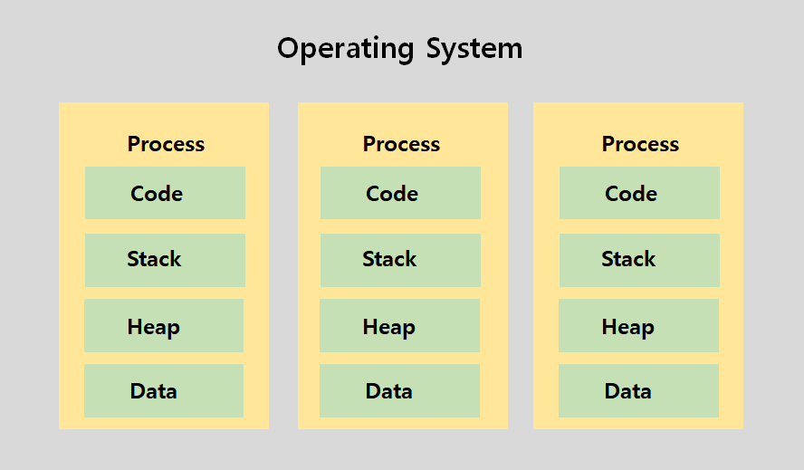
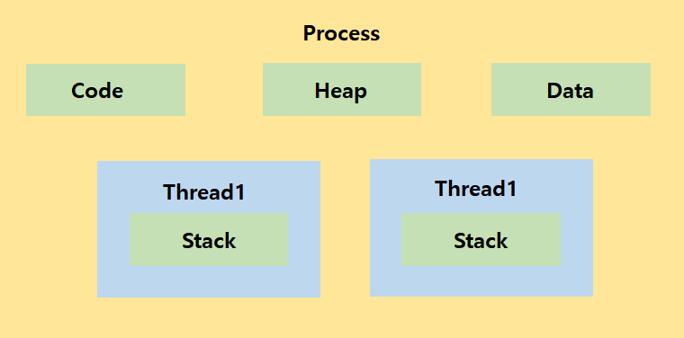
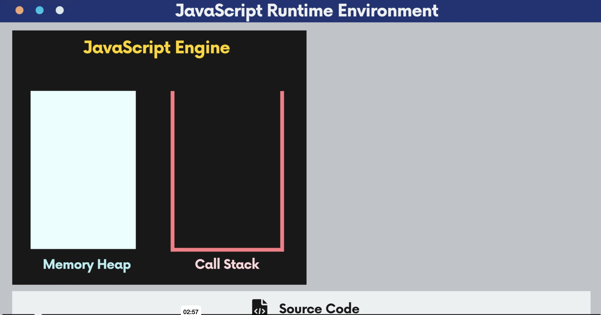
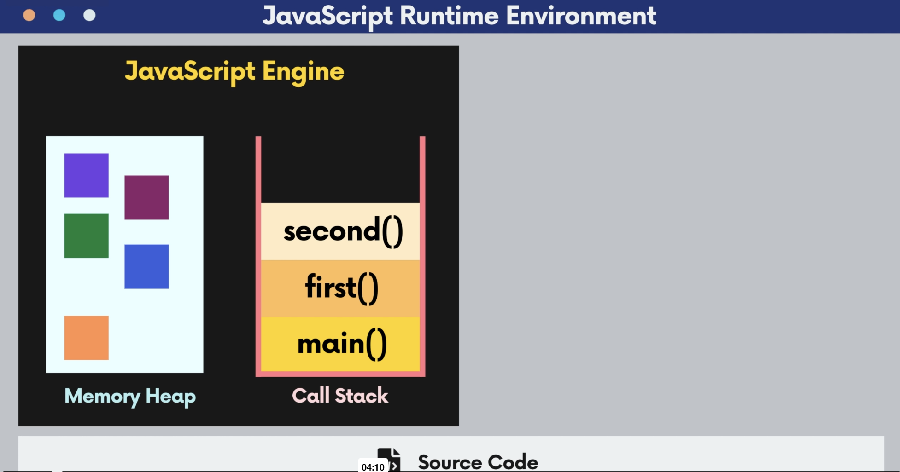
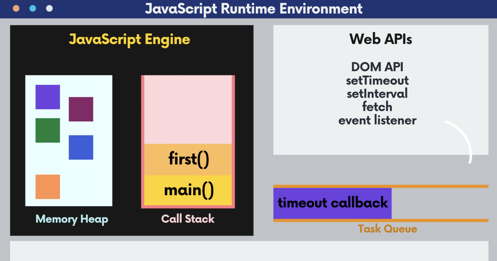
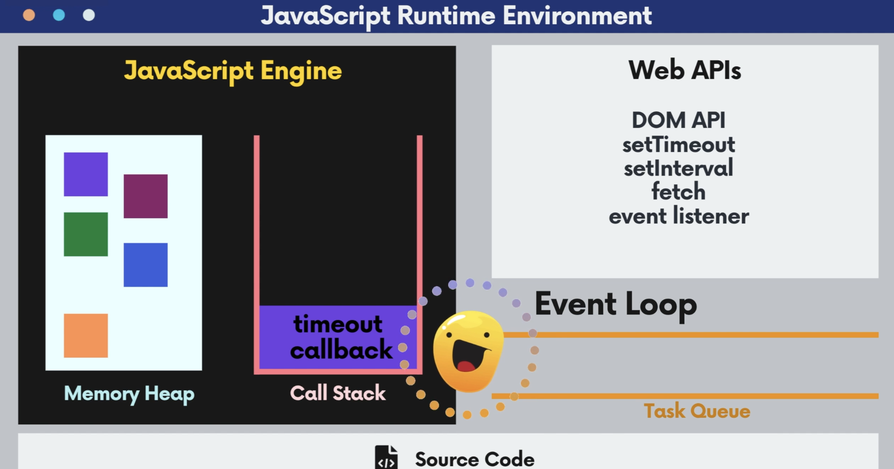
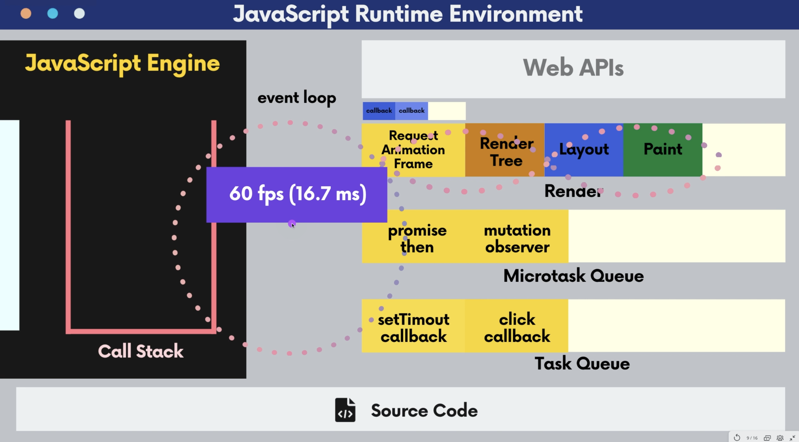

## 10.2 프로세스와 쓰레드란? 개념정리

### Process

- 프로세스란 운영체제 위에서 독립적으로 실행되고 있는 프로그램을 말한다

- 예를 들어 음악 재생 프로그램, 사진 편집 프로그램등 이러한 것들이 각각의 프로세스가 된다.

- 그리고 각각의 프로세스는 독립적으로 메모리 위에서 실행되기 때문에 특정 프로세스에 문제 생기면 그 프로세스만 종료된다.

- 각각의 프로세스마다 할당된 메모리나 데이터들이 지정되어 있는데 즉, 리소스가 정해져 있다

- 프로세스는 다음과 같이 구성되어 있다.

  - Code

    - 프로세스 안에는 프로그램을 위해서 작성된 코드가 있다

    - 즉, 프로그램을 실행하기 위한 코드가 들어있다

  - Stack

    - 그리고 그 코드와 프로세스 안에서 함수들이 어떤 순서로 실행되어야 하는지, 이 함수가 끝나면 어느 위치로 다시 돌아가야하는지에 대한 정보를 가지고 있는 스택(Stack)이 있다

  - Heap

    - 힙(Heap)은 우리가 객체를 생성하거나 데이터를 만들 때 데이터들이 저장되는 공간이다

  - Data

    - 힙에서는 동적으로 할당된 변수들이 저장되는 반면에, 데이터(Data)에는 전역 변수나 Static 변수들이 할당된다



<br/>

### Thread

- 프로세스는 프로그램을 동작하는 최고의 단위이고, 스레드는 프로그램안에서 동시에 여러개가 수행할 수 있는 작은 단위이다.

- 스레드는 자신들이 수행해야 하는 함수의 호출을 기억해야 하기 때문에, 각 스레드 마다 스택이 할당되어져 있다.

- 스레드는 한 프로세스 안에서 여러개가 동작할 수 있는데 스레드는 각각 저마다 해야하는 업무를 배정 받는다

- 하지만 프로세스 안에서 동작하는 스레드는 결국은 한 프로그램 안에서 작동하기 때문에 프로세스에 지정된 Code와 Data, Heap에 공통적으로 접근해서 업데이트가 가능하다

- 예를 들어, 음악을 들으면서 사진을 편집할 수 있다는 어플리케이션이 있다면, 음악을 재생하는 스레드 하나와 사진을 편집하는 스레드들이 저마다 작업을 수행할 수 있다

- 즉, 스레드는 동시다발적으로 발생할 수 있기 때문에 프로세스가 조금 더 효율적으로 일을 할 수 있도록 도움을 준다

- 만약 프로세스가 하나의 일밖에 일밖에 하지 못한다면 음악을 듣는 동안안 사진 편집을 할 수 없지만, 여러 스레드들이 안에 있기 때문에 다양한 일들을 동시에 할 수 있다

- 스레드에는 어디까지 작업을 수행했고, 그 다음에는 어디로 이동해야 하는지 흐름을 기억할 수 있는 고유의 Stack이 저장되어 있지만 Code나 Data, Heap 같은 공통적인 리소스는 프로세스 안에 있기 때문에 스레드는 이 프로세스에 공통적으로 할당된 리소스에 동시 다발적으로 접속해서 업데이트 하거나 공유하면서 사용한다

- 멀티스레딩이 어려운 이유는 잘못하면 공통적으로 업데이트해서 순서가 맞지 않거나 하는 문제가 발생할 수 있기 때문이다



---

## 10.3 자바스크립트 런타임 환경 (엔진 이해, 스택 개념 정리)

- 멀티쓰레딩은 한 프로세스 안에서 여러가지 쓰레드가 동시 다발적으로 일어나는 것을 말한다

- 멀티 쓰레드를 가지고 있으면 동시에 여러가지 일을 수행할 수 있기 때문에 효율적으로 프로그램이 동작할 수 있다

- 자바(Java)의 경우 언어 자체에서 멀티쓰레딩이 지원이 된다

- 따라서 특정한 데이터를 받아오는 작업은 쓰레드 A에서, 또 다른 작업은 쓰레드 B에서 시키는 방법으로 각각 수행할 작업을 쓰레드에 지정할 수 있고 총 몇개의 쓰레드가 동작하는지와 같이 멀티쓰레딩과 관련된 다양한 작업을 수행할 수 있다

- 하지만 자바스크립트는 싱글 스레드 언어(Single Thread Language)이기 때문에 언어 자체에는 멀티쓰레딩이 없다

- 자바스크립트 언어 자체에는 멀티쓰레딩을 할 수 있는 방법은 없지만 자바스크립트가 동작하고 있는 브라우저 위에는 여러가지 쓰레드가 들어있다

- 그래서 브라우저의 웹 API들을 이용하게 되면 멀티쓰레딩이 가능하다

- 그리고 자바스크립트가 동작하는 런타임 환경, 즉, 자바스크립트가 동작하고 있는 실행 환경에서는 다양한 방식을 이용해서 멀티쓰레딩 같은 효과를 얻을 수 있고 뿐만 아니라 이벤트 루프를 이용해서 더 다양한 동작을 실행할 수 있다

<br/>

### JavaScript Engine

- 웹 어플리케이션이 브라우저 위에 올라가는 순간 자바스크립트 엔진이 작성한 소스코드를 한줄 씩 해석하고 실행하게 된다.

- 자바스크립트 엔진의 구조는 크게 메모리 힙과 콜 스택으로 나누어져 있다

- 프로세스처럼 자바스크립트 엔진에도 메모리 힙과 콜 스택이 있다



- Memory Heap

  - 변수를 선언해서 객체를 할당하거나 문자열, 숫자를 할당하게 되면 그 데이터들은 전부 다 메모리 힙에 저장된다

  - 메모리 힙은 구조적으로 정리된 자료구조가 아니라 자료들이 여기저기에 아무곳에나 저장이 되어져 있다

- Call Stack

  - 함수를 실행하는 순서에 따라 차곡차곡 스택에 쌓이게 된다

  - 스택은 LIFO(Last In First Out) 구조를 가지기 때문에, 가장 마지막으로 들어간 요소가 가장 먼저 나오게 된다

  - 예를 들어, 다음과 같은 순서로 함수를 호출하게 되면 스택에는 fisrt 함수, second 함수 그리고 third 함수가 순서대로 쌓이게 된다

  

  ```javascript
  function third() {
    console.log('Third');
    return;
  }
  function second() {
    third();
    return;
  }
  function first() {
    second();
    return;
  }
  first();
  ```

  - third 함수에서 리턴을 하면 콜 스택을 보게 되는데 콜 스택에는 어디로 돌아와야 되는지에 대한 정보도 포함이 되어있기 때문이다

  - 따라서 third 함수에서 리턴을 하면 third 함수 호출이 끝난 곳으로 돌아가게 된다

  ```javascript
  function third() {
    console.log('Third');
    return;
  }
  function second() {
    third();
    // third 함수에서 return 되면 이곳으로 이동한다
    return;
  }
  function first() {
    second();
    return;
  }
  first();
  ```

  - 그리고 second 함수도 리턴이 호출되었기 때문에 second 함수의 호출이 끝난 곳으로 돌아가게 된다

  - 그리고 first 함수도 리턴이 호출되기 때문에 first 함수의 호출이 끝난 곳으로 돌아가게 되고 콜 스택에는 아무 것도 남아있지 않게 된다

  ```javascript
  function third() {
    console.log('Third');
    return;
  }
  function second() {
    third();
    // third 함수에서 return 되면 이곳으로 이동한다
    return;
  }
  function first() {
    second();
    // second 함수에서 return 되면 이곳으로 이동한다
    return;
  }
  first();
  //first 함수에서 return 되면 이곳으로 이동한다
  ```

  - 콜 스택은 함수들이 호출하는 순서를 기억했다가 함수가 끝나면 원래 있던 자리로 들어가기 위해서 쓰이는 자료구조 중 하나이다.

  - 그리고 모든 프로세스와 스레드 안에는 각가 저마다의 콜 스택이 들어가 있다

  - 일을 수행할 때 어디서 왔고 어디로 가야 되는지 정보를 기억해야 하기 때문이다

  - 다음과 같은 코드처럼 함수 안에서 자기 자신을 계속해서 호출하게 되는 재귀 함수의 경우 콜 스택에는 계속해서 endless() 가 쌓이게 되고 결국 `Maximum call stack size exceeded`라는 에러 메시지가 호출된다

  ```javascript
  function endless() {
    endless();
  }

  endless();
  ```

  - 프로세스마다, 스택 마다 지정된 콜 스택 사이즈가 있기 때문에 지정된 콜 스택 사이즈를 초과해서 에러 메시지가 발생하게 된 것이다

<br/>

## 10.4 브라우저 런타임 환경 이해 (대박 중요 또 중요 💵, 큐 개념정리 )

### Web APIs & Event Loop

- Javascript Engine, Web APIs, Event Loop는 다음과 같은 관계를 가진다



- WEB API는 브라우저에서 제공하는 API이기 때문에 브라우저의 멀티스레딩을 통해서 다양한 일들을 동시에 실행할 수 있다

- 예를 들어, first() 함수 안에서 setTimeout을 호출하고, setTimeout에는 3초뒤 'hello'를 출력하는 콜백함수를 등록한다고 했을 때, setTimeout을 호출하는 순간 setTimeout은 콜 스택에서 지워지고, Web APIs는 타이머를 시작하게 된다

- 타이머가 실행되고 있는동안에도 자바스크립트 엔진은 병렬적으로 실행이 되며, 지정된 시간이 끝나면 Web APIs는 태스크 큐에 setTimeout에서 등록한 콜백함수를 넣는다.

- Queue는 FIFO(First In First Out)의 자료구조로 처음에 들어온 요소가 가장 먼저 나가게 된다

- 콜 스택과 태스크 큐 사이를 계속해서 관찰하는 이벤트 루프가 있는데. 콜 스택에 해야할 일들이 남아 있으면 콜 스택이 비워질 때 까지 기다린 다음에, 콜 스택이 다 비어서 자바스크립트 엔진이 더 이상 일을하고 있지 않을 때 태스크 큐에 있는 것들을 하나씩 콜 스택에 가져온다. 그러면 자바스크립트 엔진은 이를 실행하게 된다



- 따라서, 콜 스택이 비어져 있다면, 콜 스택에 있는 setTimeout에 등록된 콜백 함수가 이벤트 루프를 통해서 콜 스택으로 옮겨지게 되고, 자바스크립트 엔진은 이를 실행하게 된다

- 이벤트 루프는 프로세스가 동작하는 동안 계속해서 루프를 돌면서 콜 스택이 비어져 있다면 태스크 큐에 있는 것을 한번에 하나씩 콜 스택으로 가져와서 자바스크립트 엔진이 수행할 수 있도록 도와준다

- 그리고 콜 스택이 비어지면 다시 태스크 큐에 있는 것을 하나씩 콜 스택으로 가져온다

- 만약 자바스크립트 코드의 버튼 태그에 이벤트 리스너를 등록해 놓으면, 클릭이 일어나는 순간, Web APIs는 우리가 등록한 콜백함수를 이벤트 큐에 넣게된다.

- 그리고 또 한번 버튼이 클릭되면, 등록한 콜백함수가 또 다시 이벤트 큐에 들어가게 된다

<br/>

## 10.5 드디어 전반적인 큰 그림 이해 ⭐️ (Microtask queue)

- 자바스크립트 엔진의 콜 스택에 수행중인 작업은 끝날 때 까지 보장이 된다

- 즉, 중간에 다른 태스크나 다른 일들을 할 수 없고, 지금 수행중인 코드 블럭이 끝날 때 까지 이벤트 루프가 기다렸다가 콜 스택에서 해당 작업 아래에 있는 블럭을 수행하거나 태스큐에 있는 작업이 실행된다

- 브라우저가 어떻게 구현되어 있느냐에 따라 다른 것들이 있을 수 있지만 대표적으로 Render와 Microtask Queue가 있다



### Render

- Render는 브라우저에서 요소를 움직이거나 애니메이션이 일어날 때 주기적으로 브라우저 화면을 업데이트 해주는 역할을 한다

- 브라우저에서 DOM 요소를 변형한 것이 브라우저에 표시되기 위해서는 Render Tree가 만들어지고 Layout - Paint - Composition 과정을 통해서 브라우저에 표시가 된다

- 그 전에 Request Animation Frame 이라는 API가 있는데 이 API를 통해서 콜백을 등록해 놓으면, Request Animation Frame 의 큐에 차곡차곡 쌓이게 되고 다음에 브라우저가 업데이트가 되기 전에 등록된 콜백 함수들을 실행하게 된다

- 즉, Request Animation Frame 큐에 있는 콜백들을 처리하는 경우, event loop는 Microtask Queue에서 콜백들을 처리하는 것처럼 해당 큐가 텅텅 빌떄까지 순회를 멈추게 되고 Request Animation Frame의 콜백들도 콜 스택(Call Stack)으로 전달되어 함수가 실행된다

- Even Loop는 위 그림과 같이 Call Stack과 Render, Microtask Queue, Task Queue 사이를 계속해서 돌고 있다.

- 그리고 만약 콜 스택에서 수행 중인 함수가 있다면, 해당 함수의 작업이 끝날 때 까지 콜 스택에 머무르게 된다. 그렇기 때문에 콜 스택의 함수에서 시간이 오래 걸리는 작업을 한다면 사용자에게 화면이 업데이트 되어 보여지지 않고 다른 이벤트, 클릭과 같은 것들이 발생해도 등록된 콜백함수가 실행되지 않는다

- 콜 스택에 등록된 함수의 작업이 다 끝나고 나서 이벤트 루프는 다시 움직이게 되는데 이 때, Render 쪽으로는 갈 수도 있고 가지 않을 수도 있다

- 브라우저에서는 우리가 업데이트하는 내용을 사용자에게 60 fps (frame per seconds), 1초 동안 60개의 프레임을 보여주기 위해서 노력한다.

- 사람 눈에 애니메이션이 자연스러워 보이기 위해서는 1초당 60개의 그림이 필요한데 브라우저 위에서도 사용자 눈에 부드럽게 애니메이션이 된다는 느낌을 받게 하기 위해서는 1초당 60개의 프레임을 보여줘야 하며 그렇게 하기 위해서는 16.7ms 동안 업데이트가 일어나야 한다.

- 이벤트 루프는 아주 빠른 속도로 돌고 있기 때문에 한 바퀴를 도는데 1ms도 걸리지 않는다. 그래서 1ms 마다 Render를 업데이트 할 필요가 없기 때문에, 어느 정도 시간이 있다가 16.7ms 안에서 Render를 업데이트 한번 해주고 다른 작업을 하다가 다시 어느정도 시간이 지나면 Render를 업데이트 하는 방식으로 움직인다

- 즉, 이벤트 루프가 Render를 2ms 전에 한번 거쳐 갔다면 다음 번에는 Render를 거치지 않고 마이크로 태스크 큐로 넘어가게 된다

- 콜 스택에 있는 작업이 다 끝나고 나서 이벤트 루프는 다시 순회를 시작하는데 만약 브라우저 업데이트를 할 시간이 되면 Render 시퀀스에 들어가게 된다

- 먼저 Request Animation Frame을 통해서 등록된 콜백 함수를 하나씩 다 실행한 다음에 Render Tree를 만들고 그 Tree를 이용해서 레이아웃을 계산한 다음에 페인트를 통해서 브라우저를 업데이트를 한 다음에 다시 이벤트 루프는 순회를 시작한다

<br/>

### Microtask Queue

- 태스크 큐에는 우리가 등록한 이벤트가 발생했을 때, WEB APIs에 의해 콜백함수가 태스크 큐에 들어가는 것이라면, 마이크로 태스크 큐에는 Mutation observer의 콜백함수와 와 프로미스에 등록한 콜백 함수가 프로미스를 다 수행하고 나면 들어가게 된다

- 예를 들어, 백엔드에서 데이터를 받아오는 fetch를 이용해서 프로미스를 만들고 then에 콜백 함수를 등록해 놓았다면, 프로미스의 수행이 다 끝나고 resolve가 되면 그 때 등록된 콜백이 마이크로 태스크 큐에 들어가게 된다.

- 이벤트 루프가 마이크로 태스크 큐에 콜백 함수들이 있는 것을 확인하게 되면, 콜 스택으로 가져가게 된다. 그리고 이 때 콜 스택으로 가져간 콜백 함수가 작업이 다 끝나고난 이후에도 마이크로 태스크 큐에 또 다른 콜백 함수가 있다면 이 콜백 함수를 다시 또 콜 스택으로 가져가게 된다.

- 예를 들어, 마이크로 태스크 큐의 콜백 함수를 콜 스택에서 수행하는 도중에 또 다른 콜백 함수가 마이크로 태스크 큐에 들어오게 되면, 콜 스택의 함수가 끝나는 순간 마이크로 태스크 큐에서 새로 들어온 콜백 함수를 콜 스택으로 가져가게 된다

- 그리고 콜스택에서 실행중인 작업이 끝난 후 마이크로 태스큐에 돌아왔을 때 아무 것도 없으면 다시 순회를 시작한다

- 즉, 이벤트 루프는 태스크 큐에서는 한번에 콜백 함수 하나만 콜 스택으로 가져오는 것과 달리, 마이크로 태스크 큐에서는 큐가 모두 비어있을 때 까지 계속 콜 스택으로 가져와서 수행을 하게 된다

<br/>

## 10.6 데모. 나선임 반박하는 법

- 아래 코드는 element를 생성하고나서 body에 등록한 다음 style과 innerText를 추가한 코드이다.

```html
<body>
  <button class="btn">Click</button>
  <script>
    const btn = document.querySelector('.btn');
    btn.addEventListener('click', () => {
      const element = document.createElement('h1');
      document.body.appendChild(element);
      element.style.color = 'red';
      element.innerText = 'hello';
    });
  </script>
</body>
```

- element를 생성한 다음 아무것도 하지 않고 body에 그대로 등록하면 비어져 있는 element가 body에 등록이 되기 때문에 body에 등록하기 전에 style과 innerText를 지정해야지 정상적으로 작동할 것 같지만 body 등록한 이후에 style과 innerText를 추가해도 정상적으로 동작한다

- 코드가 정상적으로 동작하는 이유를 이해하기 위해서는 우선 브라우저 런타임 환경에 대해 이해해야 한다.

- 코드를 보면 버튼에 웹 API 중 하나인 addEventListenr라는 함수를 이용해서 콜백 함수를 등록해 놓았다

- 따라서 콜백 함수의 코드 블럭은 클릭이 되었을 때 웹 API에 의해 태스크 큐로 이동하게 된다

- 태스크 큐에 등록된 아이템은 이벤트 루프에 의해 콜 스택으로 이동하게 되고, 콜 스택에서 해당 함수의 모든 작업이 다 끝날 때 까지 이벤트 루프는 기다리게 된다

- 즉, 콜백 함수 안에 있는 부분, element를 만들고 body에 등록하고 style과 innerText를 추가하는 모든 부분이 다 끝난 다음 콜 스택이 비어지게 된다

- 그리고 나서 이벤트 루프는 모든 수정 사항들이 다 적용된 상태에서 Render 시퀀스로 가게 되는 것이다

- 다시 말해, Render Tree를 만들 때는 콜백 함수 내의 모든 것들이 적용된 상태이다.

- 그러므로, 콜백 안에서 작성된 코드는 어떤 순서로 작성되던지 상관이 없는데 왜냐하면 콜백 함수가 콜 스택에 들어가는 순간 이벤트 루프는 함수가 다 실행될 때 까지 기다렸다가 나중에 Rendering 될 때 전체적으로 수정된 사항들이 Layout - Paint에 걸쳐 브라우저에 표시되기 때문이다

<br/>

## 10.7 데모: 후배에게 가르쳐 주기

```html
<body>
  <button class="btn">Click</button>
  <div
    class="box"
    style="width:100px;height:100px;background-color: bisque;"
  ></div>
  <script>
    const btn = document.querySelector('.btn');
    const box = document.querySelector('.box');
    btn.addEventListener('click', () => {
      box.style.transition = 'transform 1s ease-in';
      box.style.transform = 'translateX(800px)';
      box.style.transform = 'translateX(500px)';
    });
  </script>
</body>
```

- 해당 코드를 작성한 의도가 버튼을 누르면 800px만큼 오른쪽으로 이동하고, 또 다시 누르면 이동한 위치에서 왼쪽으로 돌아와 처음 위치에서 500px만큼 곳에 박스가 있도록 하기 위한 것이라면 실제로는 의도한 대로 동작하지 않는다

- 어떤 식으로 translate를 얼마나 많이 추가했는지 상관 없이 Rendering이 발생할 때는 최종적으로 transform에 등록한 것이 적용된다

- 그 이유는 앞서 설명한 것과 같이 콜 스택의 콜백 함수의 코드가 모두 끝날 때 까지 이벤트 루프는 콜 스택에서 기다리기 때문이다

- 즉, 콜백 함수가 수행되는 동안 이벤트 루프가 기다리기 때문에 브라우저에는 변경사항이 보여지지 않게 되고 콜백 함수가 종료된 다음에 이벤트 루프가 최종적으로 적용된 사항을 Rendering 해서 브라우저에 표시가 되는 것이다

<br/>

## 10.8 데모. 브라우저 죽이기

### Call Stack의 Loop

- 자바스크립트 런타임 환경에서는 태스크 큐와 마이크로 태스크 큐를 이용해서 비동기 처리를 한다

- 아래 코드는 콜 스택에서 작업이 수행되고 있는 동안은 절대로 렌더링이 발생하지 않는 것을 보여주는 예시이다.

- 아래처럼 작성된 코드를 실행하게 되면, 버튼을 클릭한 다음에 다시 버튼의 색깔이 돌아오지 않고 브라우저가 멈추게 된다

- 버튼을 클릭하면 web API에 의해 등록된 콜백 함수가 태스크 큐로 이동하게 되고, 이벤트 루프에 의해 콜 스택으로 콜백 함수가 이동되어 작업을 수행하게 된다.

- 하지만 `while(true)` 부분 때문에 계속해서 작업이 콜 스택에서 수행되기 때문에 이벤트 루프가 계속해서 머무르게 되고, 다시 렌더링을 하지 못하기 때문에 브라우저는 클릭을 해도 반응이 없고 버튼의 색깔도 다시 돌아오지 않는 것이다

- 그리고 시간이 지나면 `Page Unresponsive`라는 페이지가 반응을 하지 않는다는 에러 메시지가 발생한다.

- 이러한 예시를 통해서 알 수 있는 것은 콜 스택에 등록하는 함수를 작성할 때 너무 오랫동안 작업을 수행해야 하는 함수를 작성하는 것은 좋지 않다는 것이다

- 왜냐하면 이벤트 루프가 오랫동안 머물러 있는 만큼 브라우저에는 업에이트가 되지 않기 때문에 사용자의 클릭처리를 비롯한 이벤트들이 발생하지 않게 되기 때문이다

- 따라서 이러한 콜백 함수에는 간단한 작업을 수행하는 내용을 작성하는 것이 좋고 반복문이나 재귀 함수 같은 것들은 조심해서 작성하는 것이 좋다

```html
<style>
  button:hover {
    background-color: bisque;
  }
</style>

<body>
  <button>Click</button>
  <script>
    const button = document.querySelector('button');
    button.addEventListener('click', () => {
      while (true) {
        //repeat
      }
    });
  </script>
</body>
```

- 따라서 콜 스택에 등록하는 함수를 작성할 때는 너무 오랫동안 작업을 하는 함수를 작성하는 것은 좋지 않다

- 이벤트 루프가 콜 스택에 오랫동안 머무를 수록 브라우저에 업데이트가 되지 않고, 사용자의 클릭 처리 같은 이벤트도 발생하지 않기 때문에 콜백은 간단하게 작성해준다

- `while`이나 `for` 같은 `loop`나 `재귀 함수`를 작성할 때는 조심해서 사용하는 것이 좋다

<br/>

## 10.9 데모. setTimeout의 비밀

### Call Stack의 setTimout

- 아래는 재귀적으로 함수가 호출되는 경우이다.

- 버튼을 클릭하게 되면 콜백 함수가 실행되고 이 콜백 함수에 있는 `handleClick` 함수가 실행된다

- `handleClick` 함수가 실행되면 `handleClick` 이라는 문자열을 출력되고, Web API에 의해 `0 밀리 세컨드` 후에 등록된 콜백 함수가 태스크 큐에 이동하게 된다

- 태스크 큐로 이동한 콜백 함수는 다시 콜 스택으로 이동해서 수행되는데, 이 때 또 다시 `handleClick` 함수를 실행하게 된다.

- `handleClick` 함수를 호출하게 되는 과정이 계속해서 반복되기 때문에 태스크 큐에 콜백함수가 계속해서 들어오게 된다

```html
<style>
  button:hover {
    background-color: bisque;
  }
</style>

<body>
  <button>Click</button>
  <script>
    const button = document.querySelector('button');
    function handleClick() {
      console.log('handleClick');
      setTimeout(() => {
        console.log('setTimeout');
        handleClick();
      }, 0);
    }

    button.addEventListener('click', () => {
      handleClick();
    });
  </script>
</body>
```

- 앞의 예제인 `while 문`을 쓸 때와 달리 button의 색깔이 바뀌거나, button 을 클릭할 수가 있는데 그 이유는 콜 스택에 비면 이벤트 루프가 또 다시 순회를 하기 때문이다

- `handleClick` 함수가 실행되면 `setTimeout`에 등록한 콜백 함수는 Web API에 의해 `0 밀리세컨드`가 지나면 태스크 큐에 들어오게 되는데 이 때, 콜 스택이 비게되면 이벤트 루프가 다시 순회를 하게 된다

- 이벤트 루프는 태스크 큐에서 한번에 하나씩 콜 스택으로 가져오고 콜 스택의 모든 작업이 끝나면 다시 순회를 하게 되는데 이렇게 이벤트 루프가 순회하는 도중에 가끔씩은 `Rendering`를 해주기 때문에 버튼 하이라이트도 바꾸고 다양한 이벤트를 동시에 처리할 수 있게 된다

- 이렇게 `setTimeout`을 `0 밀리세컨드` 후에 실행하는 코드를 작성하는 테크닉도 많이 사용하는데, 이는 콜 스택 안에서 해당 콜백 함수를 실행하는 것이 아니라 콜 스택에서 작업이 끝나고 이벤트 루프가 다시 한 바퀴 돈 다음에 콜백 함수를 실행하고 싶을 때 사용한다

<br/>

## 10.10 데모. Promise의 비밀

### Microtask Queue의 Promise

- 이벤트 루프는 큐 태스크에 있는 것들을 콜 스택으로 하나씩 가져오지만, 마이크로 태스크에서는 큐 안에 있는 것들이 모두 없어질 때 까지 계속해서 콜 스택으로 가져오기 때문에 이벤트 루프가 머무르는 것 처럼 작동한다.

- 이벤트 루프가 `마이크로 태스크 큐`에 머무는 것 처럼 작동하는 이유는 `마이크로 태스크 큐`가 일반 `태스크 큐` 보다 더 높은 우선순위를 갖기 때문에 이벤트 루프가 `마이크로 태스크 큐`에 있는 것들을 먼저 콜 스택으로 가져오기 때문이다

- 콜 스택에서 작업이 끝나면 이벤트 루프는 `마이크로 태스크 큐`를 먼저 확인하고, 만약 콜백 함수가 있다면 해당함수를 콜 스택에서 실행한다

- 아래 예시는 마이크로 태스크 큐에 등록된 콜백 함수가 동작하는 것을 보여주는 예시이다

```html
<body>
  <button>Click</button>
  <script>
    const button = document.querySelector('button');
    function handleClick() {
      console.log('handleClick');
      //
      Promise.resolve(0) //
        .then(() => {
          console.log('then');
          handleClick();
        });
    }

    button.addEventListener('click', () => {
      handleClick();
    });
  </script>
</body>
```

- 위 코드에서 Web APIs에 의해 클릭 이벤트가 발생하면 `handleClick` 함수가 `태스크 큐`에 들어간 다음 이벤트 루프에 의해 콜 스택으로 이동해서 실행된다.

- `handleClick` 이라는 문자열을 출력되고 프로미스가 만들어지는데 이 프로미스는 만들어지면서 resolve라는 API를 호출하기 때문에 0 이라는 값을 리턴하는 프로미스가 된다.

- 프로미스가 정상적으로 0을 만들게 되면 then에 등록된 콜백 함수가 `마이크로 태스크 큐`로 이동하게 되는데, 콜 스택에서 모든 작업을 마친 이벤트 루프가 순회를 하다가 `마이크로 태스크 큐`에 등록된 콜백 함수를 콜 스택으로 가져와 다시 실행하게 된다.

- 하지만 이 때 콜백 함수가 수행이 되면 then을 출력한 다음 `handleClick`을 다시 호출하게 된다

- `handleClick`에서는 또 다시 프로미스를 만들고 then에 등록된 함수는 `마이크로 태스크 큐`로 이동하게 된다.

- `마이크로 태스크 큐`에 등록된 콜백 함수에서 `handleClick`을 또 다시 호출하기 때문에 `마이크로 태스크 큐`에 계속해서 콜백 함수가 들어오게 된다.

- 앞의 예제인 `setTimeout`과 유사한데, 이번 예제는 프로미스를 사용하기 때문에 `마이크로 태스크 큐`를 이용하게 되고, 따라서 버튼을 클릭하면 브라우저가 멈추게 되면서 다시 버튼 색깔이 바뀌지 않고 무한정 로그가 출력된다

- 이처럼 `마이크로 태스크 큐`에 아이템이 있는 경우에는 계속해서 콜 스택으로 가져와서 실행하게 되고 `마이크로 태스크 큐`가 모두 비어있게 되면 다시 이벤트 루프는 순회를 하게 된다

<br/>

## 10.11 데모. RAF의 비밀

- 아래 코드에서 버튼을 클릭하게 되면 콜백 함수가 실행되는데, 이 콜백 함수에서는 `requestAnimationFrame`이라는 API를 호출하게 된다

- 이 API는 우리가 등록한 콜백 함수가 나중에 브라우저에서 다음 렌더링이 발생하기 전에 이 콜백이 수행되는 것을 보장해준다

```html
<body>
  <button>Click</button>
  <script>
    const button = document.querySelector('button');
    button.addEventListener('click', () => {
      requestAnimationFrame(() => {
        document.body.style.backgroundColor = 'beige';
      });
      requestAnimationFrame(() => {
        document.body.style.backgroundColor = 'blue';
      });
      requestAnimationFrame(() => {
        document.body.style.backgroundColor = 'red';
      });
    });
  </script>
</body>
```

- 버튼을 클릭하면 태스크 큐로 콜백 함수가 들어가게 되고, 이벤트 루프는 콜 스택으로 해당 콜백 함수를 가져와서 실행한다.

- 그리고 각각의 `requestAnimationFrame`이라는 API를 호출하게 되면, `requestAnimationFrame` 큐 안에 `requestAnimationFrame` API를 호출하면서 등록한 콜백 함수를 순서대로 등록하게 된다.

- 이벤트 루프가 콜 스택의 모든 작업을 끝내고 Render을 하게 되면 `requestAnimationFrame` 큐로 이동을 하게 되고 해당 큐에 있는 콜백 함수를 실행하게 되는데, 큐는 FIFO(First In First Out)의 구조를 가지기 때문에 마지막으로 실행하는 red가 배경색으로 적용된 다음 Render Tree로 넘어가게 된다

- 따라서 배경색을 바꾸는 코드가 아무리 많이 있더라도 최종적으로 적용되는 색깔이 배경색으로 적용이 된다

- `requestAnimationFrame` 은 굉장히 많이 사용되는데

- `requestAnimationFrame` 은 클릭 이벤트가 수행될 때는 코드를 변경하지 않고, 나중에 브라우저가 화면을 업데이트 하기 전에 수행하고자 하는 코드가 있을 때 사용한다

- 지금 클릭이 발생한 시점에는 코드를 실행하지 않아도 되는데, 나중에 브라우저가 업데이트 되기 전에 이 코드를 수행해야 하는 경우 `requestAnimationFrame`을 사용한다

---

## Reference

- 10.3

  - [어쨌든 이벤트 루프는 무엇입니까? | Philip Roberts | JSConf EU](https://www.youtube.com/watch?v=8aGhZQkoFbQ&list=PLpjvGpURp3yjz_OYVkXdTq1TXX2P9SCbl&index=59&t=1416s)

- 10.4

  - [JavaScript Visualized: Promises & Async/Await](https://dev.to/lydiahallie/javascript-visualized-promises-async-await-5gke?fbclid=IwAR3cfIk3iVpt1EoFOflRVs4VFe6GC2m2nbkP99bWgSduAkxVCIFSXVgKYzE)

  - [이벤트 루프와 매크로·마이크로태스크](https://ko.javascript.info/event-loop)

  - [JS 태스크 큐와 이벤트 루프](https://kjwsx23.tistory.com/311)

- 10.5

  - [이벤트 루프와 매크로·마이크로태스크](https://ko.javascript.info/event-loop)

  - [JS 태스크 큐와 이벤트 루프](https://kjwsx23.tistory.com/311)

  - [https://meetup.toast.com/posts/89](https://meetup.toast.com/posts/89)
  - [The event loop by Philip Roberts at JSConf](https://www.youtube.com/watch?v=8aGhZQkoFbQ)
